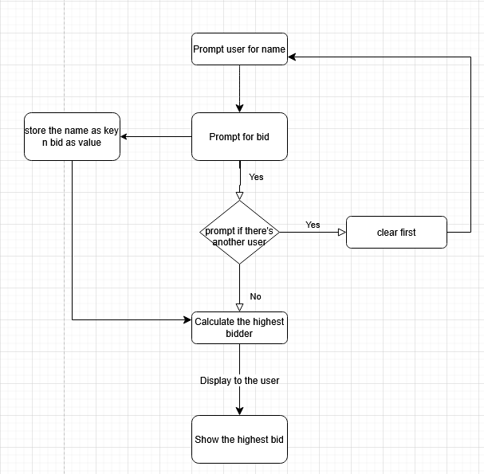

**Dictionaries and Nestings**
**Dictionaries**
Each key can only have one value
What we are storing in the dictionary:

Somethig I encountered:
key error is an error that occurs when one tries to access the dictionary with an invalid key
**Nestings**
Nest a list or a dictionary
{ 
    Key : [List],
    Key : {Dict}
}
**Todays project flowchart**:
